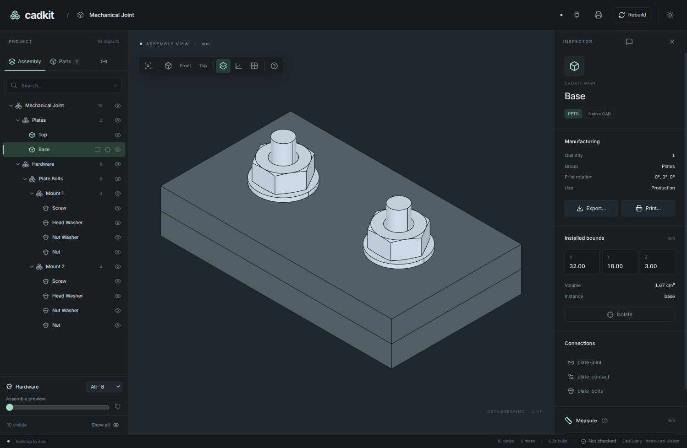

# CadKit



```python
# project.py
import cadquery as cq
from cadkit import design as d

plate = d.Part(
    "plate",
    body=lambda: cq.Workplane("XY").rect(60, 24).extrude(6),
    manufacture=d.FDM("PETG"),
    features={
        "mounting-holes": d.Hole(
            diameter=4.3, depth=6, through=True,
            pattern=d.PointPattern(((-20, 0), (20, 0))),
        ),
    },
)

assembly = d.Assembly("bracket")
assembly.fix(assembly.add("plate", plate))
PROJECT = assembly.as_project()
```

## Install

**macOS** — Apple Silicon and Intel:

```sh
curl -fsSL https://aurkakoak.github.io/cadkit/install.sh | sh
```

Open `~/Applications/CadKit.app`. Python and the CAD libraries are included.

**Windows** — download and run the `.exe` from
[Releases](https://github.com/aurkakoak/cadkit/releases/latest), or run in PowerShell:

```powershell
irm https://aurkakoak.github.io/cadkit/install.ps1 | iex
```

Builds without signing certificates may show an operating-system security warning.

**Python** — to run the example or use the CLI, install [uv](https://docs.astral.sh/uv/getting-started/installation/), then:

```sh
uv init --python 3.12 my-cad-project
cd my-cad-project
uv add "cadkit[desktop] @ git+https://github.com/aurkakoak/cadkit.git@v0.2.0"
# Save the example above as project.py.
uv run cadkit --project project:PROJECT build all
```

**Agent skill:**

```sh
npx skills add aurkakoak/cadkit --skill cadkit
```

[Documentation](https://aurkakoak.github.io/cadkit/docs/) ·
[Run from source](docs/install.md) · [Release process](docs/releases.md)
