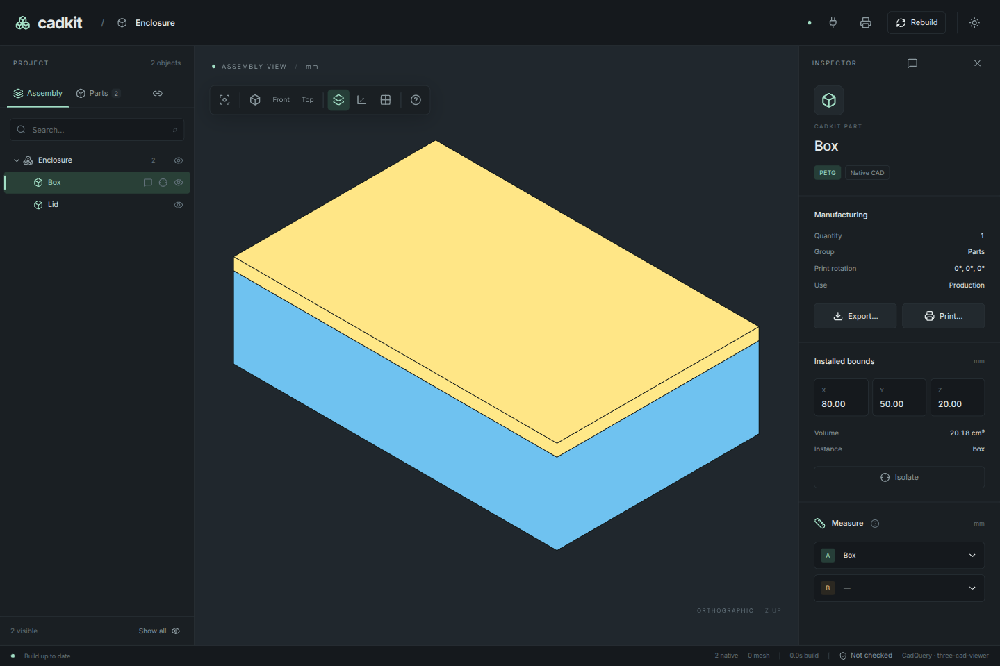
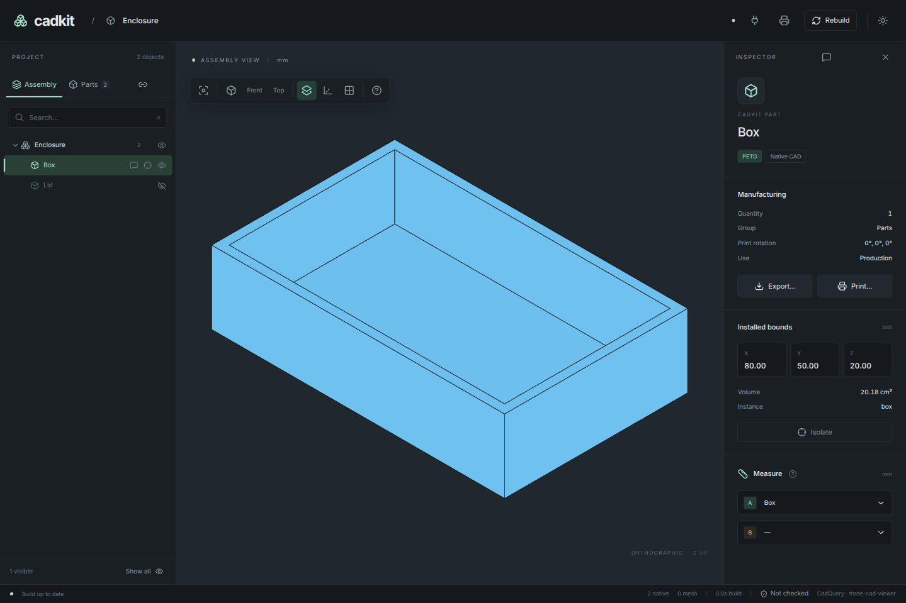

# 2. Make the shapes a project

CadQuery builds the solids. CadKit gives the solids names, manufacturing
information and an installed arrangement that the CLI, desktop and agent tools
can all read.

## Add named parts

Keep the dimension constants, `box_body()` and `lid_body()` from chapter 1.
Remove its final `if __name__ == "__main__"` export block. After the builders,
add these part definitions:

```python
--8<-- "examples/tutorial/02_project.py:parts"
```

A `d.Part` is a definition: a name, a builder and manufacturing information.
`d.FDM("PETG")` records the intended process and material. It does not change
the shape or supply printer settings.

## Arrange the parts

After the two definitions, add the assembly:

```python
--8<-- "examples/tutorial/02_project.py:assembly"
```

A `d.Assembly` contains instances of those definitions. Here it has one `box`
and one `lid`. `fix` places each instance at the default frame, so the coordinates
you wrote in chapter 1 are also their installed coordinates. This is enough for
two loose parts. In chapter 4, a fastening connection will place the lid instead.

The `explode` vector is a presentation offset for exploded views. It does not
move the installed lid or change exported manufacturing geometry.

Finally, `as_project()` adapts the design into a `cadkit.Project`. Assigning it
to `PROJECT` makes the file importable by the existing tools. It captures the
design at that point, so keep that line after your assembly declarations.

Your file is now ready to run. To check your edits or start at this chapter,
expand the complete example and copy it into `enclosure.py`.

??? example "Complete project: enclosure.py"

    ```python
    --8<-- "examples/tutorial/02_project.py"
    ```

## Read it from the terminal

```sh
uv run cadkit --project enclosure:PROJECT list
```

The output should contain `box` and `lid`, each with material `PETG` and
quantity `1`. `enclosure:PROJECT` means “import `enclosure.py` and read its
`PROJECT` attribute.”

You can also inspect the project description without building the solids:

```sh
uv run cadkit --project enclosure:PROJECT describe
```

Look for the same two names and their manufacturing information in the JSON.
Those stable names are how you will select parts for exports and agent work.

## Open it in CadKit Desktop

Install the app on Linux or macOS if you have not already:

```sh
curl -fsSL https://aurkakoak.github.io/cadkit/install.sh | sh
```

On Linux, run:

```sh
"$HOME/.local/bin/cadkit-desktop" \
  --project-dir "$PWD" --project enclosure:PROJECT \
  --python "$PWD/.venv/bin/python"
```

On macOS, run:

```sh
"$HOME/Applications/CadKit.app/Contents/MacOS/CadKit" \
  --project-dir "$PWD" --project enclosure:PROJECT \
  --python "$PWD/.venv/bin/python"
```

The explicit Python path uses the same environment as your CLI. Keep the app
open while working through the tutorial. You should see the closed enclosure
and `box` and `lid` in its assembly tree.

[](../assets/tutorial/box-and-lid.png)

Hide the lid with its eye button. The hollow interior should now be visible.
Show it again, then select the box. Its inspector should identify the `box`
part. Try changing `HEIGHT` to `24` in your editor: after saving, the app
rebuilds the geometry while retaining the view. Restore `20` before continuing.

[](../assets/tutorial/box-interior.png)

[Complete example](../../examples/tutorial/02_project.py) ·
[← Make the shapes](01-box-and-lid.md) ·
[Next: inspect and export →](03-inspect-and-export.md)
