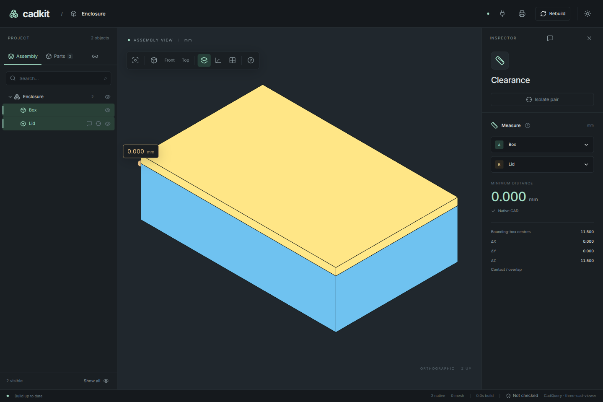

# 3. Inspect and export the parts

Before adding hardware, measure the model and produce files for each part.
You will use the names introduced in the previous chapter.

## Inspect a part

Run:

```sh
uv run cadkit --project enclosure:PROJECT inspect box
uv run cadkit --project enclosure:PROJECT inspect lid
```

Both commands build the selected part and print geometry measurements as JSON.
The box has outer dimensions 80 × 50 × 20 mm and volume approximately
20,176.896 mm³. The lid has dimensions 80 × 50 × 3 mm and volume 12,000 mm³.
The box volume is smaller than a solid 80 × 50 × 20 block because of its cavity.

In the app, select the box and lid together with Shift-click. Their minimum
distance appears automatically in the inspector. It should be **0 mm** because their surfaces meet at
the rim. A zero distance alone does not prove that parts are correctly fitted:
it also occurs when solids overlap. You will declare the intended contact in
chapter 5.

[](../assets/tutorial/inspect-and-export.png)

## Export both parts

```sh
uv run cadkit --project enclosure:PROJECT build all --output-dir build/enclosure
```

Open `build/enclosure`. It contains `box.stl`, `box.step`, `lid.stl`, `lid.step`
and `manifest.json`, together with quantity and group metadata. The manifest
records measurements, file names and hashes. STL is a mesh for workflows such
as slicing; STEP preserves the native solid geometry.

Each part is exported independently in its manufacturing orientation. CadKit
moves its lowest Z coordinate onto the build plane. In the box's STEP file,
the floor is therefore at Z = 0 even though its authored floor is at Z = −20.
The assembled arrangement is a separate output:

```sh
uv run cadkit --project enclosure:PROJECT assembly --output build/enclosure-assembled.step
uv run cadkit --project enclosure:PROJECT assembly --exploded --output build/enclosure-exploded.step
```

The first keeps the lid on the rim. The second lifts the lid by its 20 mm
`explode` offset, without changing either part definition.

## Keep a runnable export script

Add this entry point after `PROJECT = DESIGN.as_project()` if you want
`uv run python enclosure.py` to export both parts:

```python
--8<-- "examples/tutorial/03_export.py:export"
```

Importing this file in the app still only exposes `PROJECT`; it does not write
exports. The command-line entry point calls the same exporter used by
`cadkit build`.

To start at this chapter, copy the complete snapshot into `enclosure.py`.

??? example "Complete project with export command: enclosure.py"

    ```python
    --8<-- "examples/tutorial/03_export.py"
    ```

[Complete example](../../examples/tutorial/03_export.py) ·
[← Make a project](02-project.md) ·
[Next: fasten the lid →](04-fasten-the-lid.md)
