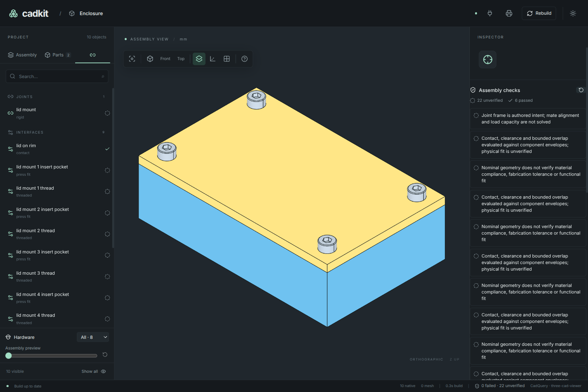

# 5. Check a change before exporting

The mount describes where parts and hardware belong. Now tell CadKit two more
things about the assembly: the lid must meet the rim, and a straight driver
must be able to reach each screw.

## Declare contact and access

In `enclosure.py`, add this interface immediately before the final
`PROJECT = DESIGN.as_project()` line:

```python
--8<-- "examples/tutorial/05_checks.py:contact"
```

The contact interface permits a maximum gap of 0.01 mm and no material overlap.
It checks the two named parts in their installed positions.

Then add the driver-access declaration, still before `as_project()`:

```python
--8<-- "examples/tutorial/05_checks.py:access"
```

This supplies a 3 mm diameter, 30 mm long straight probe at each screw seat,
checked against the box and lid. It checks that particular tool envelope
against the listed obstacles. It does not describe every possible driver
handle or an entire assembly procedure.

These are the only additions to chapter 4. If you are starting here, copy this
complete snapshot into `enclosure.py`.

??? example "Complete enclosure with checks: enclosure.py"

    ```python
    --8<-- "examples/tutorial/05_checks.py"
    ```

## Read the report

```sh
uv run cadkit --project enclosure:PROJECT validate-assembly --output build/assembly-checks.json
```

The command prints the report and writes the same JSON to
`build/assembly-checks.json`. With this example, the summary should have
`fail: 0`; the overall status is **`incomplete`**. Find the passing
`lid-on-rim` contact, `engagement`, `bottoming` and driver-access findings.

`incomplete` is expected. The inserts are qualified envelopes; the model does
not establish their physical fit, the printed material's strength, screw
preload or a complete assembly sequence. Keep those unverified findings when
you share the result. They are different from a confirmed geometric failure.

You can run and inspect these checks in the app's **Connections** tab too.

[](../assets/tutorial/checks.png)

## Make one bad change

Change the constant near the top of `enclosure.py`:

```python
SCREW_LENGTH = 4
```

Run the validation command again. It should return a nonzero exit status and
an `engagement` failure: only 1 mm of the screw reaches beyond the 3 mm lid,
below the declared 3 mm minimum.

Try exporting this bad version:

```sh
uv run cadkit --project enclosure:PROJECT build all --output-dir build/short-screw
```

The export should stop with the confirmed assembly failure. The validation
report remains in that output directory so you can inspect why it stopped.

Restore `SCREW_LENGTH = 8`, validate again, then export:

```sh
uv run cadkit --project enclosure:PROJECT validate-assembly --output build/assembly-checks.json
uv run cadkit --project enclosure:PROJECT build all --output-dir build/enclosure
```

There should be no confirmed failures, and both parts should export. The build
manifest retains the mechanical review, including its unverified findings.
You now have a useful edit loop: change one parameter, inspect the geometry,
validate the assembly, then export.

[Complete example](../../examples/tutorial/05_checks.py) ·
[← Fasten the lid](04-fasten-the-lid.md) ·
[Next: work with an agent →](06-work-with-an-agent.md)
