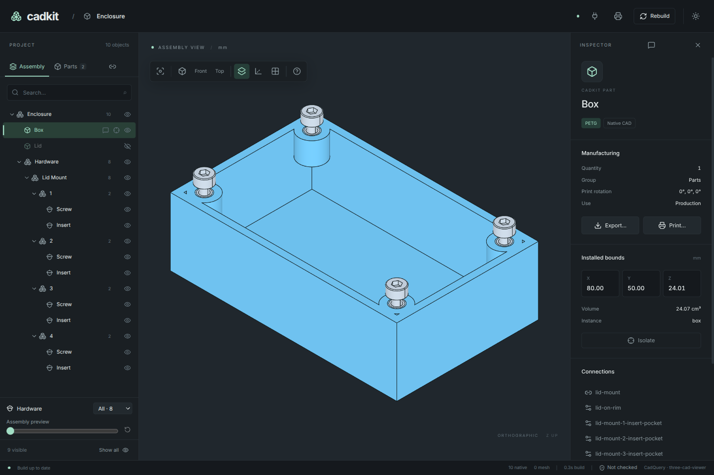

# 6. Make a scoped change with an agent

Your model now has named parts, explicit dimensions and checks. Give an agent a
small change whose result you can review in both code and the running app.

Continue with the checked enclosure from chapter 5. Keep the app open with
`--project enclosure:PROJECT` as in [chapter 2](02-project.md).

If you are starting here, expand this chapter's complete starting point and
save it as `enclosure.py`. It has the same model and checks as chapter 5.

??? example "Complete starting point for the agent task: enclosure.py"

    ```python
    --8<-- "examples/tutorial/06_agent.py"
    ```

## Give the agent the instructions and live view

From your model directory, install the CadKit skill:

```sh
npx skills add aurkakoak/cadkit --skill cadkit
```

Choose your agent host in the installer. Node/npm is needed for this skill
installation command; the packaged desktop's MCP server does not need a
separate Node installation.

In CadKit Desktop, click the **plug icon** and copy the MCP configuration for
this session into your agent client's MCP settings. The copied configuration
contains the app executable, project directory and project reference. Use the
same project that is open in the app.

The skill teaches the agent how to work; MCP lets it inspect your actual running
session. The agent's coding environment supplies file editing and terminal
commands. CadKit MCP itself does not edit arbitrary files or run shell commands.

Start a fresh agent conversation in the model directory, or reload the client's
skills and MCP configuration. Select the box in the app, then use this prompt:

> Use the CadKit skill and the open CadKit app. Read `enclosure.py` and inspect
> my selected box. Increase the box height from 20 mm to 24 mm by changing
> `HEIGHT`. Keep the rim at Z = 0, preserve the lid and its four mounting sites,
> and do not change the screw or insert specifications. After the rebuild,
> inspect both parts and run `validate-assembly`. Export both parts to
> `build/taller-enclosure`. Tell me what changed, any confirmed failures, and
> what remains unverified. Do not slice or print anything.

## Review the result

The code change should be `HEIGHT = 24`. The box's floor should move from
Z = −20 to Z = −24 while the rim, lid and hardware stay in place. The outer
box dimensions should now be 80 × 50 × 24 mm. Its pads still descend 8 mm
from the rim, and its floor stays 2.4 mm thick.

[](../assets/tutorial/taller-box.png)

The desktop bounds include a small numerical margin (24.01 mm in this view);
the authored height is 24 mm.

Ask the agent to show the interior with the lid hidden and capture a screenshot.
Its geometry-dependent MCP calls should first read `get_state` and use the
current revision and object IDs. If a file edit rebuilds the model, the agent
must read the new state before measuring it again.

Verify the same result yourself:

```sh
uv run cadkit --project enclosure:PROJECT inspect box
uv run cadkit --project enclosure:PROJECT inspect lid
uv run cadkit --project enclosure:PROJECT validate-assembly --output build/taller-checks.json
uv run cadkit --project enclosure:PROJECT build all --output-dir build/taller-enclosure
```

The lid should still measure 80 × 50 × 3 mm. The BOM should still contain four
screws and four inserts. The mechanical report should have no confirmed
failures and should retain the earlier unverified findings.

You have used the same project through geometry creation, assembly, inspection,
export, mechanical checks and agent work. Keep the dimensions, names and checks
in source control so that later changes can be reviewed in the same way.

## Choose your next task

These how-to guides start from an existing project:

- [Export parts and review checks](../how-to/export-and-check.md).
- [Choose fasteners and describe fit](../how-to/fasteners-and-fit.md).
- [Inspect and measure a model](../how-to/inspect-and-measure.md).
- [Connect an agent to the app](../how-to/connect-an-agent.md).
- [Prepare parts for a slicer](../how-to/slice-parts.md).
- [Build nested assemblies](../how-to/nested-assemblies.md).

[Complete example](../../examples/tutorial/06_agent.py) ·
[← Check a change](05-check-and-change.md) · [Tutorial overview](index.md)
