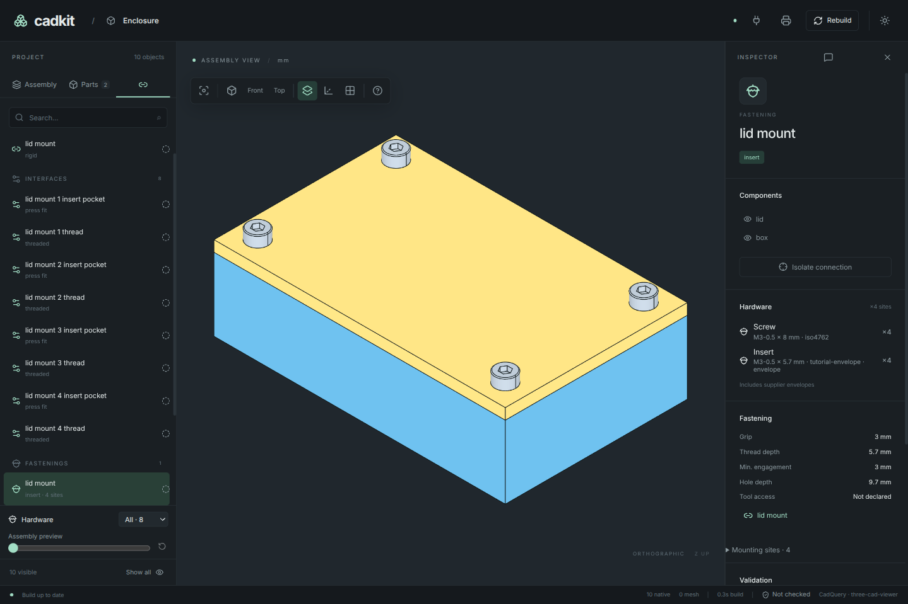

# Build a box with a lid

Start with two CadQuery shapes and turn them into a project you can inspect,
export, fasten together and change with an agent. You will keep working on the
same enclosure: an 80 × 50 mm box with a removable lid.

Screenshots throughout the tutorial open at full size when clicked.

You need basic Python and a terminal. You may have heard of CadQuery, but you do
not need an existing CadQuery project. The tutorial explains the few geometry
operations it uses. Allow about an hour, plus the initial dependency download.

The code uses CadKit 0.5.2. All six chapters have complete, runnable example
files. Follow along in one `enclosure.py`, or use a chapter's example to restart at that point.

| Chapter | What you will have | Complete example |
| --- | --- | --- |
| [1. Make the shapes](01-box-and-lid.md) | A hollow box and a flat lid, exported as STEP | [01_box.py](../../examples/tutorial/01_box.py) |
| [2. Make a project](02-project.md) | Named parts visible in CadKit Desktop | [02_project.py](../../examples/tutorial/02_project.py) |
| [3. Inspect and export](03-inspect-and-export.md) | Measured parts, STL files and native STEP files | [03_export.py](../../examples/tutorial/03_export.py) |
| [4. Fasten the lid](04-fasten-the-lid.md) | Matched holes, insert pockets, screws and a hardware BOM | [04_fasteners.py](../../examples/tutorial/04_fasteners.py) |
| [5. Check a change](05-check-and-change.md) | Explicit contact/access checks and a caught screw-length error | [05_checks.py](../../examples/tutorial/05_checks.py) |
| [6. Work with an agent](06-work-with-an-agent.md) | A scoped edit reviewed against the running model | [06_agent.py](../../examples/tutorial/06_agent.py) |

The enclosure is a learning model. In chapter 4, the inserts are explicitly
labelled envelopes so that choosing a real insert and establishing its printed
fit remain visible work. The tutorial's successful checks describe geometry,
not a tested physical product.

[Start: make the shapes →](01-box-and-lid.md)
